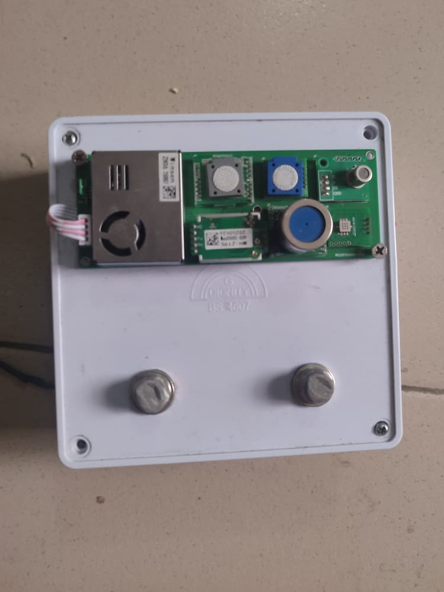
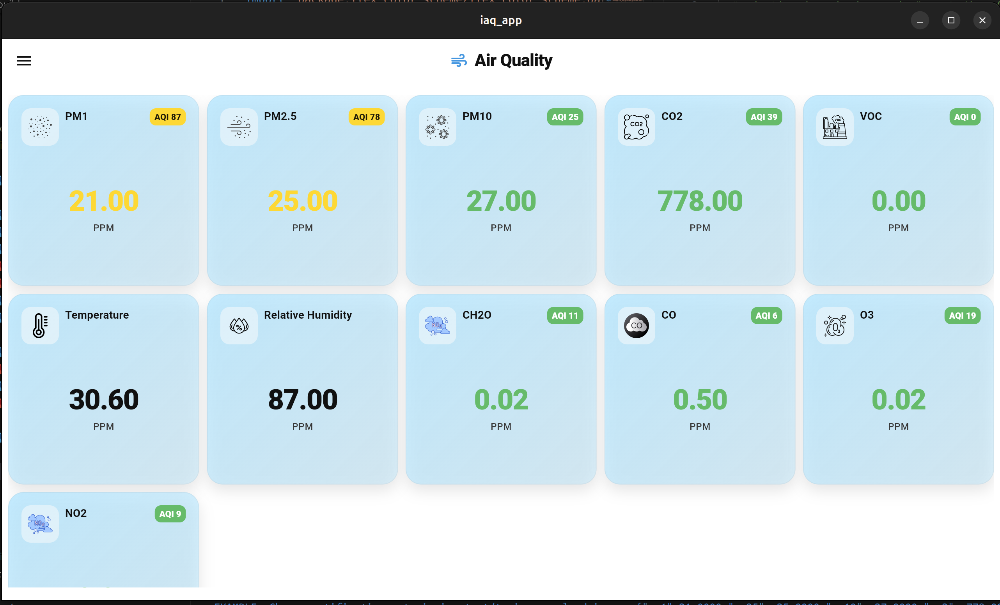
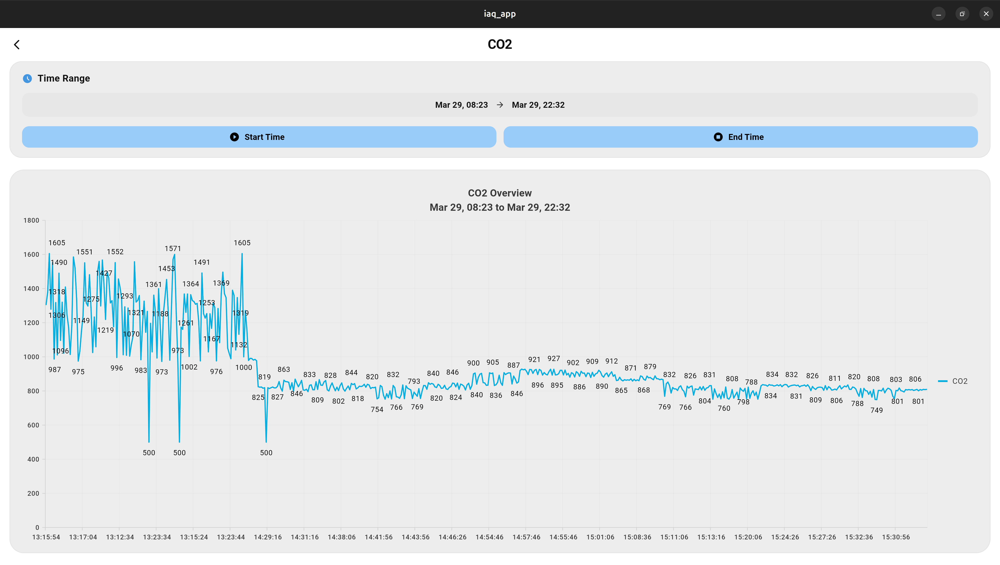
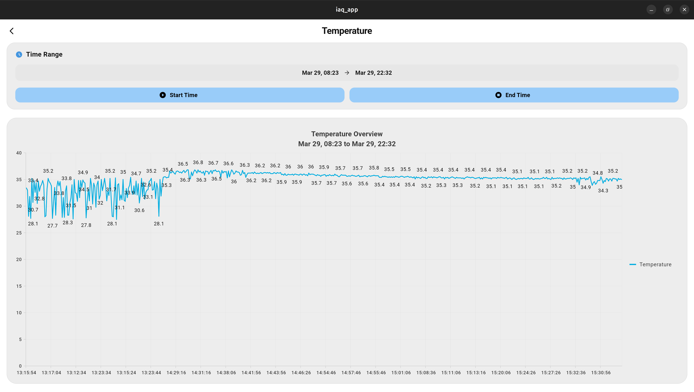
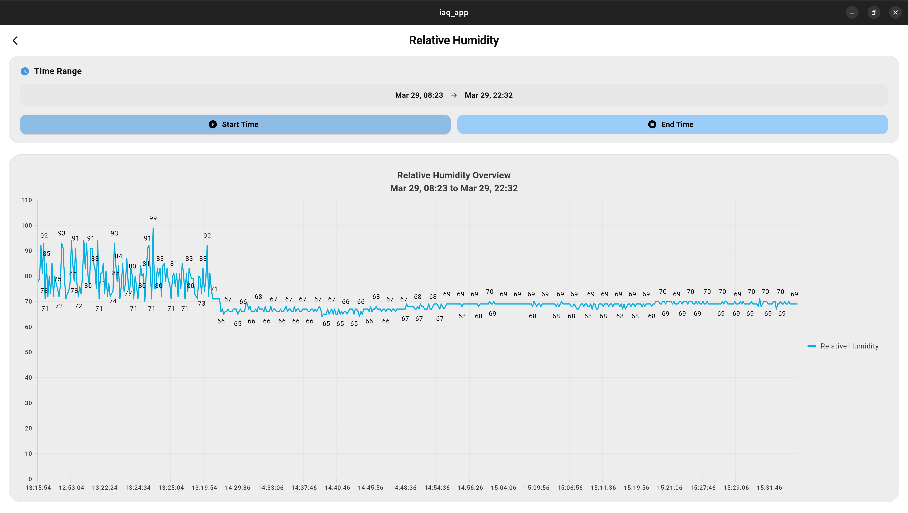

# Air Quality System

**Real-time indoor air quality monitoring — from sensor to app.**

The Air Quality System is an end-to-end IoT solution that continuously measures environmental conditions and delivers live data to users through a cross-platform mobile and desktop application. It is designed for environments where air quality visibility matters — homes, offices, research labs, and beyond.

---

## Current Status

A fully functional prototype has been developed and validated. It measures the following parameters in real time:

| Parameter | Description |
|---|---|
| **PM1** | Ultrafine particulate matter |
| **PM2.5** | Fine particulate matter (health-critical) |
| **PM10** | Coarse particulate matter |
| **CO₂** | Carbon dioxide concentration |
| **VOC** | Volatile organic compounds |
| **Temperature** | Ambient temperature |
| **Relative Humidity** | Atmospheric moisture level |

Data is sampled every **10 seconds** and streamed live to the companion app, where it can be visualised in real time and queried historically for trends and insights.

---

## Screenshots

| Hardware | Dashboard |
|---|---|
|  |  |

| CO₂ | Temperature | Relative Humidity |
|---|---|---|
|  |  |  |

## Repository Structure

The project is divided into three main parts:

1. **iaq_hardware**: Hardware design files (KiCad project)
2. **iaq_firmware**: Firmware source code (C++/CMake project)
3. **iaq_mobile_app**: Mobile and Desktop application source code (Flutter project)

### Required Skills

To contribute effectively, familiarity with the following is recommended:

- Raspberry Pi Pico development
- CMake build system
- KiCad for PCB design
- Basic scripting (Bash, Python, etc.)

---

## Project Overview

- **iaq_hardware**:  
  Contains KiCad schematics and PCB layouts. This folder serves as a reference for hardware connections and pin assignments. The hardware is modular to simplify prototyping and validation.

- **iaq_firmware**:  
  Modular firmware designed for easy collaboration and testing. CMake is used for building, enabling separation of hardware-specific and general-purpose code. The firmware emphasizes professional embedded development practices, including unit testing and dual-target testability (host and target).

- **Testing**:  
  [CppUTest](https://cpputest.github.io/) is used as the unit testing framework. The codebase is structured to allow hardware-independent testing on the host system by decoupling hardware-specific code.

---

## Directory Layout

```
.
├── build/                  # Build output directory
├── CMakeLists.txt          # Top-level CMake configuration
├── docs/                   # Documentation (Doxygen config, HTML, LaTeX)
├── include/                # Public header files
│   └── blink.h
├── pico_sdk_import.cmake   # Pico SDK import script
├── README.md
├── src/                    # Source code
│   ├── CMakeLists.txt
│   ├── main.cpp
│   ├── pico/
│   ├── sensors/
│   │   ├── pico/
│   │   ├── CMakeLists.txt
│   │   ├── sensor.cpp
│   │   └── sensor.h
│   └── wifi/
│       ├── pico/
│       ├── CMakeLists.txt
│       ├── wifi.cpp
│       └── wifi.h
├── tests/                  # Unit and integration tests
│   ├── host/
│   ├── target/
│   └── third_party/
├── third_party/            # External dependencies
└── tools/                  # Helper scripts
    ├── dual_target_test_build_run.sh
    └── dual_target_test_build.sh
```

### Folder Descriptions

- **build/**: Output directory for compiled binaries.
- **docs/**: Doxygen configuration and generated documentation.
- **include/**: Public header files.
- **src/**: Main firmware source code, organized by functionality (e.g., sensors, wifi).
- **tests/**: Unit tests for both host and target environments.
- **third_party/**: External libraries and dependencies.
- **tools/**: Scripts for building, flashing, and running tests.

---

## Getting Started with `iaq_firmware`

1. **Set up the Pico SDK**  
   Install the Raspberry Pi Pico SDK, preferably using the VS Code extension.

2. **Clone the Repository**  
   ```
   git clone <repo-url>
   cd iot_air_quality_board
   git checkout dev
   ```

3. **Branching**  
   Before starting development, create a new branch for each feature:
   ```
   git checkout -b feature/<your-feature>
   ```

4. **Development Workflow**  
   - Copy existing modules as templates for new features.
   - Update CMake files to include new source files.
   - Use provided scripts and VS Code tasks for building and testing.

5. **Building the Main Application**  
   From the `build` directory:
   ```
   cmake -S .. -B . && cmake --build . -j$(nproc)
   ```

6. **Running Tests**  
   - **dual_target_test_build.sh**:  
     Builds all tests for either host or target.  
     Usage:  
     ```
     ./tools/dual_target_test_build.sh [host|target]
     ```
   - **dual_target_test_build_run.sh**:  
     Builds and runs a specific test for host or target.  
     Usage:  
     ```
     ./tools/dual_target_test_build_run.sh [host|target] <test_folder>
     ```

7. **VS Code Integration**  
   - Tasks and task buttons are set up for easy use.
   - Install the "Tasks Buttons" extension for quick access.

**Note:**  
Ensure `iaq_firmware` is set as the root of your VS Code workspace for tasks to work correctly.

---

## Contributing

- Follow the modular structure for new features.
- Write unit tests for new code.
- Document your code and update the documentation as needed.

---

For more details, refer to the documentation in the `docs/` folder.